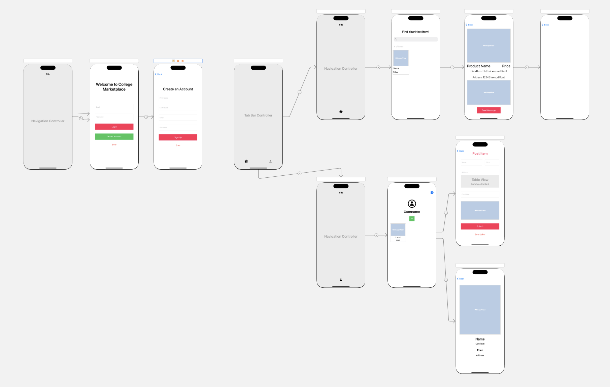

# College Marketplace

IOS App created help college students sell and post second-hand items for sale. Utilizes Firebase for Authentication, Storage, and Database, and UIKit Framework on Swift.

User can login, create an account, create posts, view other posts, and preliminary implementation of chat functionality using Message Kit

## Demo

Currently unavailable

## Storyboard

## Libraries

- FirebaseAuth
- FirebaseFirestore
- FirebaseStorage
- MapKit
- PhotoKit
- MessageKit

